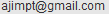

# gmvc20: Global Map Saint Vincent and the Grenadines 2.0
## non-commercial use

## commercial use
  

## note
Credit: "Global Map of St. Vincent and the Grenadines © ISCGM/ Lands and Surveys Department"

Contact: Lands and Surveys Department.

E-mail: 
